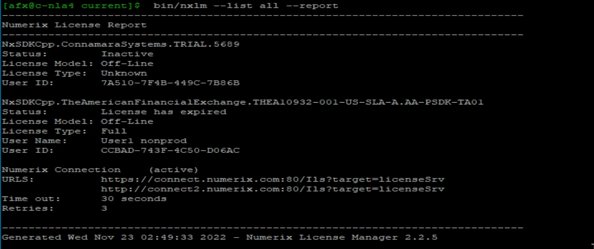
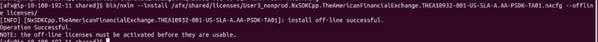
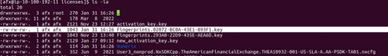
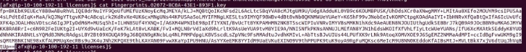
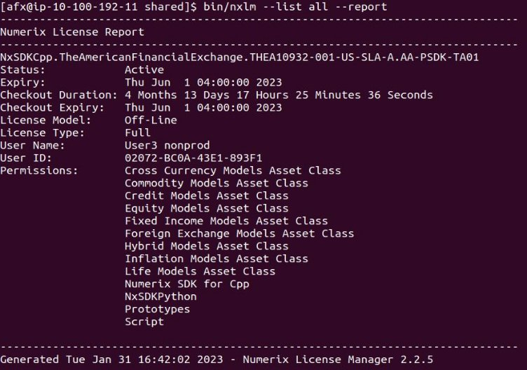

AFX Numerix Offline License Upgrade Steps:

1. **First of all we need to open AFX Linux’s Jump Server at CBOE through the VM  Horizon client and Putty terminal from your Windows machine.**

SSH in to the environment box you wish to update the license

➢**Prod:** nla1r1/nla1r2

➢**DR:** cla1r3/cla1r4

➢**Cert:** c-nla4 (formerly assurance)

➢ **Demo:** c-nla5 (formerly api)

2. **ssh to the server from jumpbox server**
1. ssh server-name
1. (**eg. ssh c-nla-4**)
3. **Login as admin (afx)  on the server**
1. ssh afx@server-name
1. (**eg. ssh afx@c-nla4**)
4. **Go to the shared folder repo.**

a. cd /afx/shared

5. **Check the details of the currently installed license**

a. bin/nxlm --list all –report

6. **When no license installed**

a. No licenses or connections installed.

7. **Uninstall the existing license**
1. bin/nxlm --uninstall <license name>
1. (**eg. bin/nxlm --uninstall NxSDKCpp.TheAmericanFinancialExchange.THEA10932-001-US-SLA-A.AA-PSDK-TA01**)

8. **Set license path, where license data will be exported**
1. export NX\_LICENSE\_DIR=/afx/shared/licenses
1. echo $NX\_LICENSE\_DIR

9. **Install new numerix license**
1. bin/nxlm --install <license\_key\_path> --offline licenses/
1. (**eg. bin/nxlm --install /afx/shared/licenses/User3\_nonprod.NxSDKCpp.TheAmericanFinancialExchange.THEA10932-00 1-US-SLA-A.AA-PSDK-TA01.nxcfg --offline licenses/**)

10. **After installation we get the Fingerprints key file inside licenses folder, use the latest key (Note: Verify by timestamp)**

11. **cat licenses/Fingerprints.02072-BC0A-43E1-893F1.key and copy its contents**

12. **Open Notepad and paste the copied contents & Save the fingerprint file with .key extension**
12. **Open this URL**⇒ **[https://connect.numerix.com/nxls/nxgetkey.jsp**](https://connect.numerix.com/nxls/nxgetkey.jsp)**

14. **Click on Choose file & upload the saved fingerprint key file.**
14. **Click on Generate Licenses**
14. **Click on Download License Activation Key(s) link for the activation key.**
14. **Open this activation key file in Notepad & copy its contents**
14. **Switch to the linux terminal and open VI Editor, paste the copied contents & Save the activation\_key file with .key extension**

a. (**eg. vi  /afx/shared/licenses/activation\_key.key**)

or

**Copy the downloaded activation\_key file into /afx/shared/licenses folder**

19. **Activate the installed license**

a. bin/nxlm --activate --offline /afx/shared/licenses/activation\_key.key

20. **Check details of the installed current license**

a. bin/nxlm  --list all --report

